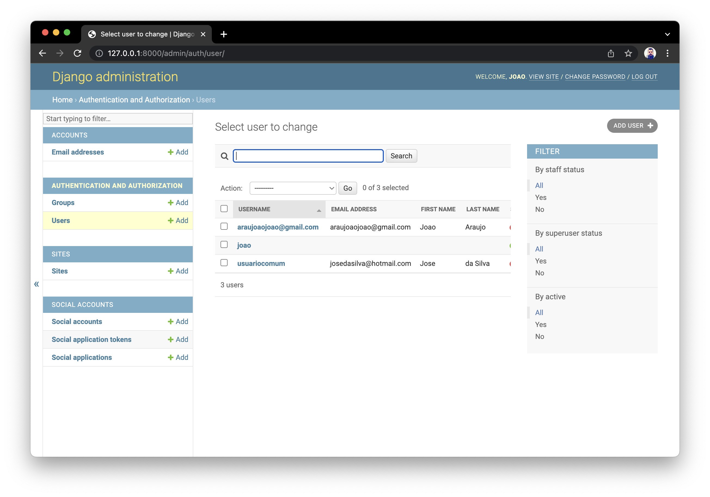

# REGISTER_USER

Challenge
```
* Construir pelo menos dois endpoints utilizando Django e Python
* Cadastrar usuário com login, senha e data de nascimento
* Consultar usuários cadastrados.
```

Passo a Passo
```
python3 -m venv .venv
source .venv/bin/activate
pip install django
pip install djangorestframework
pip install django-allauth
brew install python3
django-admin startproject register_user .

git init
git add .
git commit -m "first"

django-admin startapp pages

pip install django-crispy-forms

python3 manage.py migrate
python3 manage.py runserver
```




Requirements
```
Python 3.4+
Django 3.1.8+
Django All Auth
```

References
```
https://www.fabioruicci.com.br/artigos/tutorial-django-cadastro-e-login-de-usuarios-apenas-com-e-mail-e-senha/
```
